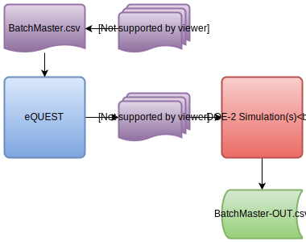
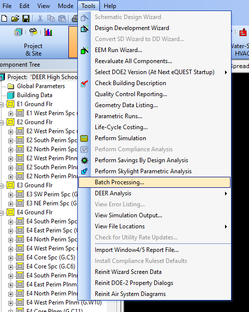

# Functioning
The basic work-flow of the batch processing is the following:

## BatchMaster.csv and Tables.csv
The BatchMaster.csv file contains a description of all the simulation the user wish to run. The description includes information regarding the file names, type of simulation or analysis to run, a list of all the 
## eQUEST
The batch processing feature in eQUEST is in the Tools menu of the main task bar. 

Depending on your installation the batch processing feature might be greyed-out. To activate it, locate the eQUEST.INI (or eQUESTDOE23.INI if you are using DOE-2.3) in the eQUEST data folder (usually located in Documents\eQUEST 3-**** Data\). Open it in a text editor and locate the following entry:
> EnableBatchProcessing=

Change its value from 0 to 1. If this entry is not present in your eQUEST.INI file add it under:

> [preferences]

## Input Files
## DOE-2 Simulations
## BatchMaster-Out.csv

